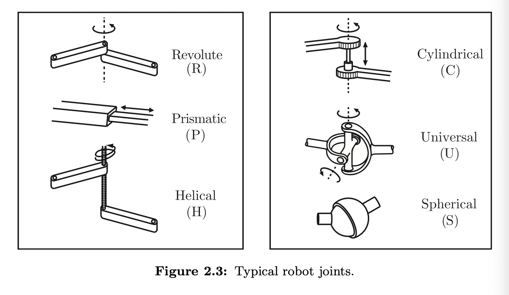
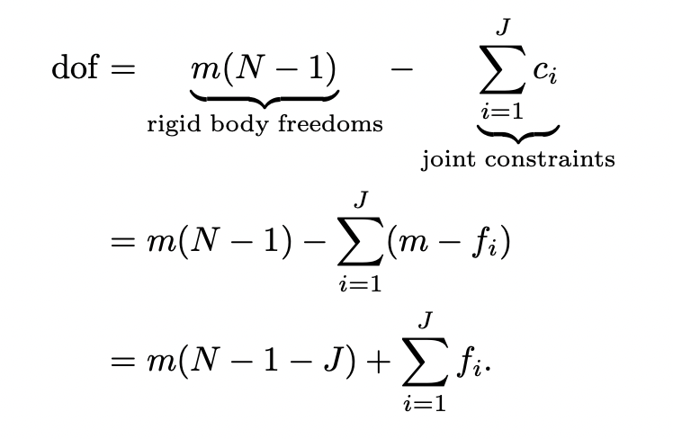

# Configuration Space

## Introduccion

⭕️ Un robot esta configurado por una serie de **eslabones** o links  unidos por **articulaciones** o joins, los eslabones que mencionamos tienen la peculiaridad que son **cuerpos rigidos**. 

⭕️ Usualmente tambien tenemos el **efector** el cual es el ultimo eslabon de una cadena cinematica este a su vez se utiliza para manipular objetos. 

⭕️ Los **actuadores** son los que generan fuerzas o torques para que los eslabones se muevan.

⭕️ Para saber donde esta un robot necesitamos saber su **configuracion**. Debido a que sus eslabones son cuerpos rigidos y conocemos su forma, solo necesitamos pocos parametros para saber su configuracion.

    🔆 Para saber la configuracion de un punto en el plano necesitamos dos parametros `(x, y)`.

    🔆 Para saber la configuracion de una puerta necesitamos un parametro `θ`

--------

✍🏽 **Configuracion:** Es conocer las posicion de todos los puntos del cuerpo rigido para nuestro caso es el robot.

✍🏽 **Grados de libertad:** Es el numero real mas pequeno necesario para representar su configuracion.

✍🏽 **Espacio de configuracion** Son todas las posibles configuraciones que puede tener un cuerpo rigido.

## 2.1 Grados de libertad de un cuerpo rigido

⭕️ Los grados de libertad tambien puede ser la dimension del espacio de configuracion.

------

✍🏽 **Cuerpo Rigido Espacial:** Es un cuerpo rigido que se mueve en un espacio de 3 dimensiones el mismo que tiene 6 grados de libertad.

✍🏽 **Cuerpo Rigido Planar:** Es un cuerpo rigido que se mueve en un plano de 2 dimensiones el mismo que tiene 3 grados de libertad.

------

$GDL = \sum_\ Libertad\ de\ un\ cuerpo -  numero\ de\ restricciones\ ind$

## 2.2 Grados de libertad de un robot

⭕️ Podemos determinar los grados de libertad de un robot contando el numero de cuerpos rigidos y articulaciones, esta aproximacion nos lleva a la formula de Grubler.

⭕️ Las articulaciones pueden conectar 2 o mas eslabones pero solos nos centraremos en la mas simple de todas, articulaciones que conecta 2 eslabones.

### 2.2.1 Articulaciones de un Robot 

⭕️ **Articulacion Revoluta:** Permite rotacion sobre su eje

⭕️ **Articulacion Primastica:** Permite traslacion sobre su eje articulado.

⭕️ **Articulacion Helicoidal:** Permite rotacion y traslacion dependiente entre ellas, es decir al rotar tambien me traslado, este movimiento ocurre sobre el eje del tornillo.

⭕️ Las articulaciones antes mencionadas tienen un grado de libertad.

⭕️ **Articulacion Cilindrica:** Permite rotacion y traslacion indpendientes entre ellas, es decir, que puedo rotar sin estasr forzado a trasladarme.

⭕️ **Articulacion Universal:** Son un par de articulaciones revolutas unidad por sus eje de forma ortogonal.

⭕️ Ambas son articulaciones con dos grados de libertad.

⭕️ **Articulacion Esferica:** Tiene 3 grados de libertad, esta junta permite el movimiento relativo de un cuerpo respecto a otro.

⭕️ Las juntas se las puede consideras como restricciones de movimiento que sufren los 2 cuerpos rigidos que une.

### 2.2.2 Formula de Grubler

    1️⃣ m ➡️ numero de grados de libertad de un cuerpo rigido (3 si es un cuerpo rigido planar 6 si es espacial).

    2️⃣ N ➡ numero de eslabones.

    3️⃣ J ➡️ numero de articulaciones.

    4️⃣ fi ➡️ numero de grados de libertad de la articulacion.

> 💥 **Importante:** Esta formula funciona solo si todas las articulaciones presentan restricciones independientes. 

-----

✍🏽 **Mecanismos de cadena cerrada:** Es cualquier mecanismo con un lazo cerrado en sus eslabones.

    🔆 Una persona para con sus dos piernas tocando el suelo

✍🏽 **Mecanismos de cadena abierta:** Son mecanimos que no forman lazos cerrados con sus eslabones.

    🔆 Por ejemplo, un brazo humano cuando nuestra mano esta libre en el espacio.

⭕️ Un mecanismo con 0 grados de libertad es una estructura rigida.

------

## 2.3 Configuracion de Espacios: Topologia y Representacion

------
### 2.3.1 Topologia del Espacio de Configuracion

✍🏽 **Topologia:** De un espacio es la forma del mismo.

⭕️ Dos espacios son topologicamente equivalente si uno puede deformarse suavemente en el otro.

    🔆 Una esfera se puede deformar en un balon de futbol americano simplemente estirandolo.

    🔆 Una espera no se puede deformar en un plano, la unica manera que una esfera se vuelva un plano es cortando la esfera y estirando. Por ende no son topologicamente equivalente.

⭕️ El circulo, la linea, intervalos abiertos, intervalos cerrados son ejemplos de espacios de una dimension.

⭕️ El intervalo abierto es topologicamente equivalente a la linea mientras que el intervalo cerrado no, debido a que una linea no tiene puntos finales.

⭕️ La topologia es una propiedad fundamental propia del espacio y no depende de donde o como escogemos la coordenada para representar un punto en dicho espacio.

⭕️ Muchas configuracion de espacios puede ser representada por el producto cartesiano de 2 o mas spacios con menor dimension.

⭕️ la superficie de una esfera, el toroide, la superficie de un cilindro, el plano son ejemplos de espacios de 2 dimensiones.

> 💥 **Importante:** Solo se puede deformar estirando el espacio, esta operacion de estirar no modifica la dimension.

-------
### 2.3.2 Representacion del Espacio de Configuracion

⭕️ Para poder utilizar el poder computacional necesitamos representaciones numericas de los espacios.

    🔆 Un vector es una representacion de un punto en un espacio Euclidiano.

⭕️ A diferencia de la topologia la representacion no es una propiedad fundamental debido a que podemos representar un espacio de diversas formas.

    🔆 Un punto en un espacio 3 dimensional puede ser representado de diversas formas dependiendo del marco de referencia que se tome, por ejemplo el (0, 0, 0) y de la escala.

✍🏽 **Parametrizacion explicita:** Es cuando escogemos la minima cantidad de parametros o coordenadas para representar un espacio con n dimensiones.

⭕️ En muchos casos debido a que la topologia del espacio es diferente a la del espacio euclidiano la representacion tendra algunas zonas deficientes llamadas **singularidades**.

    🔆 Si nos movemos con una velocidad constante a una latitud constante cerca del ecuador podemos observar que nuestra longitud cambia suavemente. Mintras que si nos movemos a una velocidad constante a una latitud cerca del polo norte o polo sur nuestra longitud cambia de manera muy rapidamente.

    💥 **Importante:** Esto no tiene que ver con la topologia del espacio es solo un problema con neustra representacion.

⭕️ Para evitar estas singularidades podemos utilizar dos formas, coordinate chart y implicit representation.

✍🏽 **Coordinate Chart:** Consiste en dividir el espacio en diferentes sub espacios cada una con su representacion explicita y sus coordenadas.

    ✅ Al ser un sub conjunto es mas facil de leer ya que tienes la informacion del espacio en partes.

    ❌ Necesitas estar buscando la tabla correcta para la posicion que deseas para evitar las singularidades

✍🏽 **Implicit representation:** Consiste en representar un espacio de n dimensiones en un espacio Euclidiano de mas de n dimensiones con sus respectivas restricciones.

    🔆 Una esfera de que es un espacio de dos dimensiones lo podemos representar de forma implicita con un espacio de 3 dimensiones (x, y, z) con una restriccion (radio constante).

    ✅ NO hay singularidades.

    ✅ NO necesitamos multiples catalagos para ubicar un punto en el espacio.

    ✅ Es mas facil hacer una representacion implicita en mecanismos de cadena cerrada, debido a que usamos una ecuacion de cierre para representar el mecanismo.

    ❌ Tiene parametros que grados de libertad. en vez de variar longitud y latatitud, ahora debes variar x, y, z.

---------

## 2.4 Restricciones de velocidad y configuracion

---------
## 2.5 Espacio de Tareas y Espacio de Trabajo

⭕️ Estos dos espacios tienen que ver solo con la configuracion del efector del mecanismo no con la configuracion de todo el robot.

✍🏽 **Espacio de Tarea:** Es el espacio en donde las tareas del robot se pueden expresar de forma natural.

✍🏽 **Espacio de Trabajo:** Son todas las posibles configuraciones que puede alcanzar el efector del robot.

⭕️ El espacio de trabajo esta dado principalmente por la estructura del robot y es independiente de la tarea.

⭕️ El espacio de trabajo y el espacio de tarea involucran una eleccion del usuario.

⭕️ No necesariamente todo los puntos del espacio de tarea son alcanzadas por el robot. Mientras que todas las posiciones en el espacio de trabajo son alcanzadas por el robot en al menos una configuracion.

⭕️ Dos mecanismos con diferentes espacios de configuraciones pueden tener el mismo espacio de trabajo. 

⭕️ Dos mecanismos con el mismo espacio de configuraciones puede tener distintos espacios de trabajo.

--------

